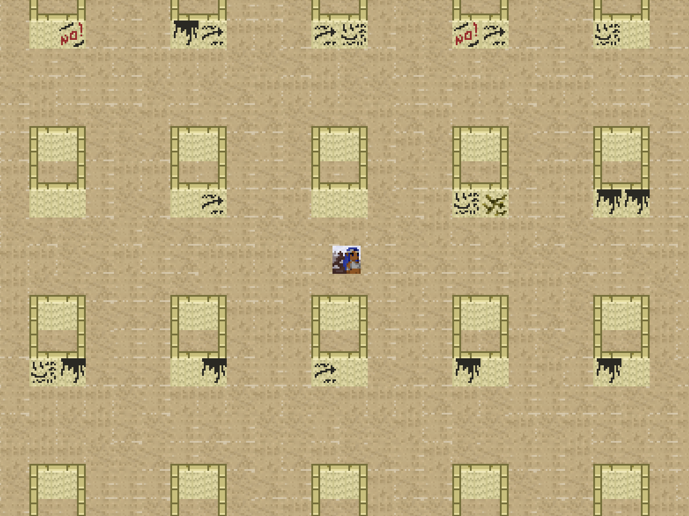
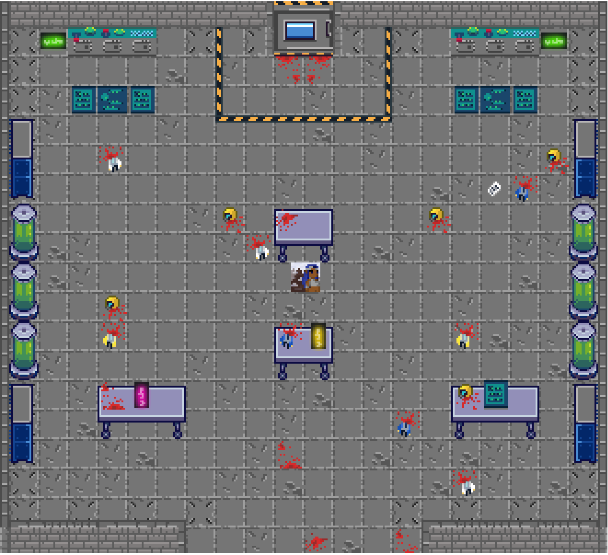
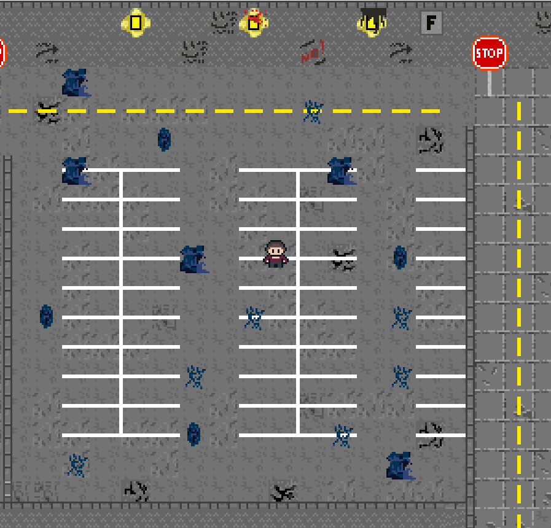
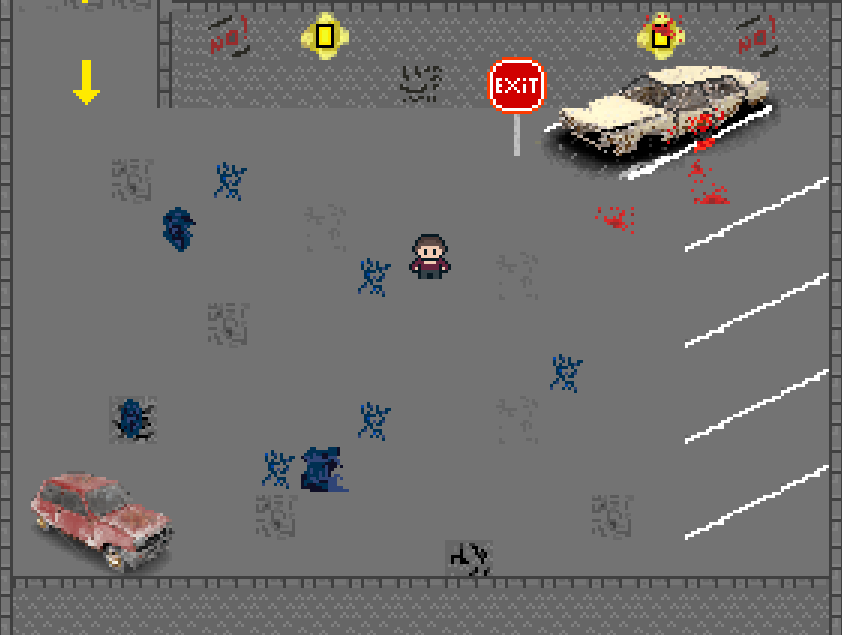
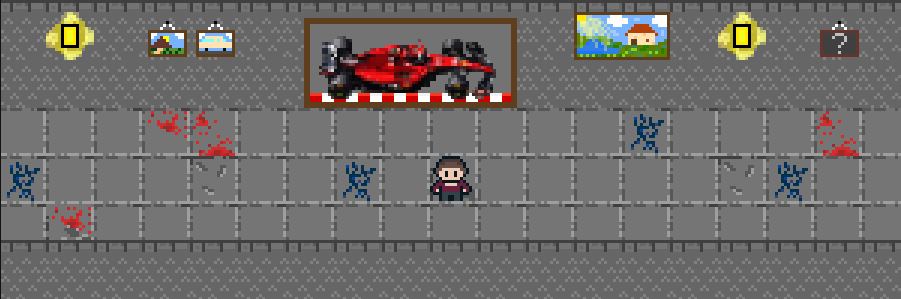
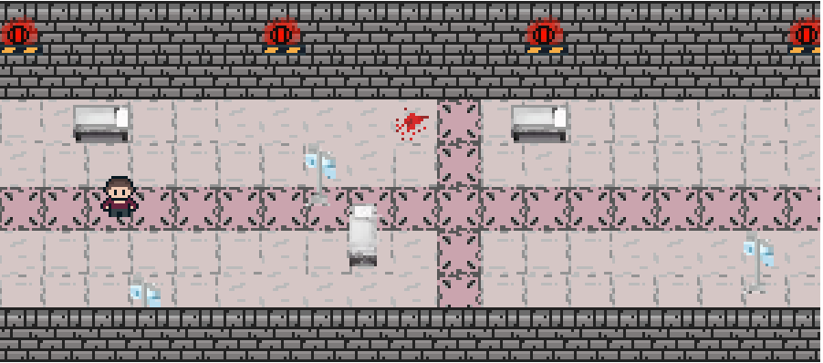
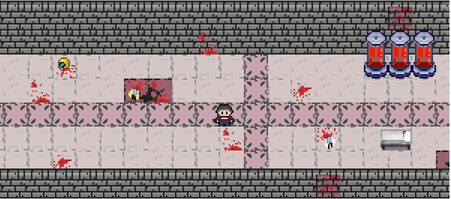
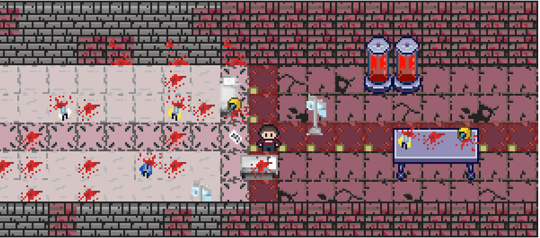
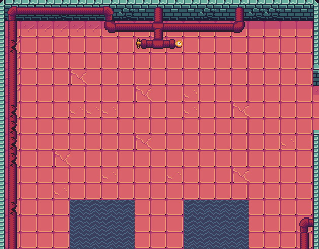
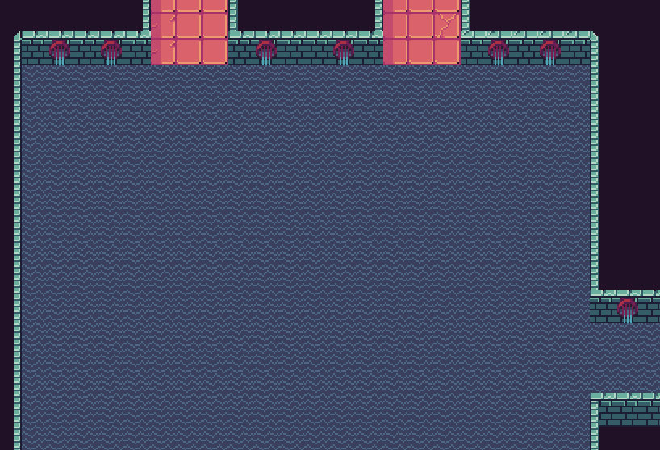

# The Backrooms Game

## Enredo

Se você não for cuidadoso e *noclippar* da realidade nas áreas erradas, você acabará nos Backrooms, onde existe apenas o fedor de um velho tapete úmido, a loucura constante do mono-amarelo, o interminável ruído de fundo de luzes fluorescentes no zumbido máximo e aproximadamente seiscentos milhões de quilômetros quadrados de salas vazias segmentadas aleatoriamente para se estar preso.

Deus o salve se você ouvir algo vagando por perto, pois com toda certeza ele ouviu você.

## Narrativa

Um adolescente foi *noclippado* da realidade e acabou parando no nível 0 das Backrooms, o Lobby. Perdido, ele deverá explorar os níveis e enfrentar os desafios que cada um proporciona, para que encontre a saída para os Frontrooms, a sua realidade original, também conhecida como planeta Terra.

## Gênero

O jogo tem os seguintes gêneros:
* **Ação**, que será encontrado no combate contra as entidades e nos enigmas dos níveis.
* **Terror**, visto na ambientação dos cenários e nos efeitos sonoros do jogo.
* **Sobrevivência**, pois o jogador deverá escapar de labirintos *infinitos* enquanto se esconde das entidades presentes.

## Roteiro

O jogo terá uma visão top-down, ou seja, a câmera estará acima do jogador em todos os momentos.

### Nível 0 - O lobby
* **Ambiente**: As salas encontradas nesse nível tem o chão e as paredes cobertas por carpete amarelo. Pinturas de instruções ou de avisos feitas com um líquido preto e gosmento podem ser encontradas durante o percurso da sala, além de fluidos como esse começando infestações em cantos de salas ou no chão.

* **Saída**: A saída desse nível é por uma porta de contenção trancada, e para abrir ela, será necessário encontrar a chave em um laboratório.

* **Laboratório**: Em alguma parte dessas salas, haverá um laborátorio. Ao entrar no laboratório, o jogador deverá se encontrar com o seguinte relatório, que conterá a chave para a saída do nível 0:
  - "Async Research Labs - Relatório de Teste 2x1321234 (scratched)/(scratched)/1987
  
  As entidades escaparam da porta de segurança. Conseguimos exterminar a maioria delas, porém algumas fugiram e o dano no laboratório foi irreversível. Perdemos muitos companheiros, e a passagem para as frontrooms foi destruída. Não há mais como sair daqui. Estamos presos. Só sobraram Bob, Steve e eu, porém, não vou sobreviver por muito mais tempo. A entidade que me atacou me deixou com uma ferida que não para de sangrar, e os outros dois estão tentando encontrar uma saída na porta de segurança de código vermelho, entretanto dúvido que consigam sobreviver. A entidade que me atacou está lá. Ela está esperando por eles. Ela está esperando por todos nós. Não há mais esperança.

  Por favor, Bob e Steve, se vocês sobreviverem e acharem minha carta, digam à minha familia que... (sangue no resto do papel)"

Além disso, ao longo do mapa vão existir outros relatórios que contarão mais sobre a história do jogo.

* Referência: https://backrooms.fandom.com/wiki/Level_0 

### Nível 1 - A garagem
* **Ambiente**: As salas encontradas nesse nível são parte uma garagem gigante. Parte dessas garagens possuem caminhos fechados que contém quadros e pinturas antigas. A energia é cortada de tempos em tempos e, durante esses apagões, entidades estarão liberadas para caçar os jogadores, que devem possuir apenas uma lanterna e devem fugir das entidades.

* **Saída**: A saída desse nível é *noclippando* da realidade para outro nível, e isso deverá ocorrer depois que o jogador solucionar o enigma presente nos quadros.

* **Enigma dos quadros**: Na garagem, o jogador encontrará uma série de quadros pendurados nas paredes do corredor.
Um outro corredor possui cinco interruptores numerados de 1 a 5. Cada quadro possui um elemento especial ou peculiar que pode ser relevante para desvendar a ordem correta para ativar os interruptores. Então o jogador terá que examinar cada quadro para descobrir a ordem dos interruptores. Ao acertar a ordem, uma sala secreta irá ser aberta, e nela terá uma chave, que o jogador vai utilizar no carro bege para ativar o *noclip*.

* Referência: https://backrooms.fandom.com/wiki/Level_1

### Nível 2 - Pipedream
* **Ambiente**: As salas encontradas nesse nível são parte de um sistema de encanamento gigante, lotadas de entidades. As paredes são feitas de canos, e os ambientes são pequenos e fechados. Ao entrar no nível, o jogador terá acesso a uma espingarda, que poderá ser usada para matar as entidades.

* **Saída**: A saída desse nível é por meio das armadilhas, ou *pitfalls*, que são buracos 'sem fundo' que podem levar o jogador a qualquer nível. Podem ser achadas aleatoriamente pelas salas.

* Referência: https://backrooms.fandom.com/wiki/Level_2

### Nível ! - Corra pela sua vida
* **Ambiente**: O nível se passa em um hospital antigo abandonado e é composto por milhares de salas trancadas e acessíveis por um único e extenso corredor, com mais de 10 quilômetros. O jogador aparece no começo da sala, e tem apenas alguns segundos para se preparar antes que todas as entidades vistas anteriormente, e algumas novas, o ataquem. O jogador deve, então, correr pela sua vida enquanto desvia dos obstáculos presentes no corredor, como mesas ortopédicas, cadeiras, equipamentos antigos, etc.

* **Saída**: A saída desse nível é encontrada no final do corredor. Basta o jogador chegar nela.

* Referência: https://youtu.be/C1mythLI55M

## Storyboard

1. Planejamento inicial de uma sala do nível 0

2. Planejamento inicial do laboratório do nível 0

3. Planejamento inicial da garagem do nível 1

4. Planejamento inicial da sala de carros do nível 1

5. Planejamento inicial do corredor com quadros do nível 1

6. Planejamento inicial do hospital do nível THE END

7. Planejamento da parte intermediária do nível THE END

8. Planejamento da parte final do nível THE END

9. Planejamento inicial de uma sala do nível 2

10. Planejamento inicial de uma sala do nível 2

